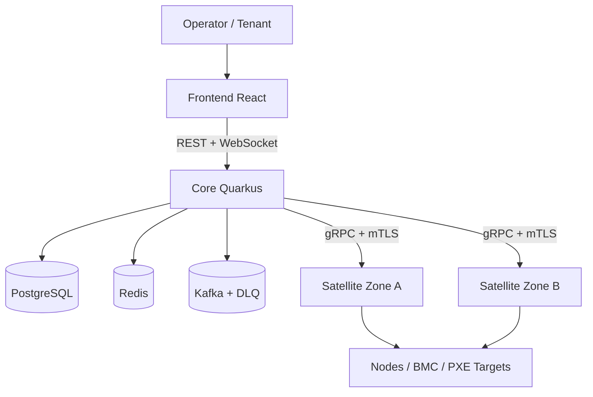

# 超大规模服务器集群生命周期管理架构

> 更新日期: 2026-04-08
> 说明: 本文只保留与当前 `hyperscale-lcm` 主干实现一致的架构描述。

## 1. 架构目标

项目面向大规模 GPU / 裸金属资源池，目标是在统一控制面中打通以下主链路：

- 设备发现与待纳管池管理
- Redfish / 凭据档案 / claim 驱动的自动接管
- 基于 GPU / NVLink / IB Fabric 的智能调度
- Docker / Shell / Ansible / SSH 执行闭环
- WebSocket 与 OpenTelemetry 驱动的实时可观测性

## 2. 当前系统拓扑

## 3. 组件职责

### 3.1 Core

Core 是控制面中心，当前负责：

- REST API、认证、RBAC、多租户与配额
- Satellite 注册、心跳、状态管理
- Timefold 调度与 Zone 分区并行求解
- 作业状态持久化、Kafka 事件、WebSocket 广播
- Discovery、Credential Profile、Claim、Cluster 汇总等业务接口

### 3.2 Satellite

Satellite 是边缘执行与采集单元，当前负责：

- 与 Core 建立 gRPC + mTLS 长连接
- Redfish 采集与模板化适配
- DHCP 监听与网络扫描发现
- Docker / Shell / Ansible / SSH 命令执行
- PXE / TFTP / iPXE / Cloud-Init 基础服务
- 状态回调与 trace context 透传

### 3.3 Frontend

前端承担主要运维入口，当前已落地：

- Dashboard
- Jobs / Job Detail
- Discovery 与 Claim 操作
- Credential Profiles
- Satellites / Tenants
- Topology 可视化

## 4. 核心链路

### 4.1 发现与纳管

1. Satellite 通过 DHCP 监听、网络扫描、Redfish 采集发现设备。
2. Core 将候选设备写入 `DiscoveredDevice`，并结合 `CredentialProfile`、模板目录、secret ref 做 claim 规划。
3. 对于可自动接管的设备，Core 通过真实 Redfish claim 验证完成认证与托管账号收敛。

### 4.2 调度与执行

1. 用户提交 Job 或 Allocation 请求。
2. Core 按 `clusterId` 过滤活跃 Satellite，再按 `zoneId` 分区求解。
3. Timefold 输出最优分配后，Job 先落为 `SCHEDULED`。
4. Dispatcher 根据 `executionType` 下发 `EXEC_DOCKER`、`EXEC_SHELL`、`EXEC_ANSIBLE` 或 `EXEC_SSH`。
5. Satellite 执行并回传状态；Core 转发 `jobs.status`，同时通过 WebSocket 刷新前端。

### 4.3 观测与诊断

- Metrics: Prometheus
- Dashboarding: Grafana
- Trace: OpenTelemetry / Jaeger
- Health: Quarkus health endpoints
- Current trace continuity: `Satellite -> Kafka -> Core`

## 5. 当前落地特性

| 主题 | 当前状态 |
|------|----------|
| 多集群字段与调度隔离 | 已落地 |
| Zone 分区并行调度 | 已落地 |
| GPU / NVLink / IB Fabric 拓扑展示 | 已落地 |
| 多执行模式 | 已落地 |
| Claim / Vault / CMDB bootstrap | 已落地 |
| PXE 基础服务 | 已落地 |
| PXE 全闭环重装 | 进行中 |
| AlertManager 外部通知 | 进行中 |

## 6. 仍需补齐的架构闭环

- 真实硬件环境下的 Redfish / BMC 验收
- AlertManager 邮件 / Slack / PagerDuty 通知接线
- DHCP option `66/67`、镜像管理、节点特定模板的 PXE 闭环
- 更完整的多集群生命周期管理与联邦能力

## 7. 结论

当前架构已经从“设计草图”进入“主链路闭环基本可用”的阶段。后续重点不再是重写架构，而是把剩余的交付闭环和真实环境验收做实。
